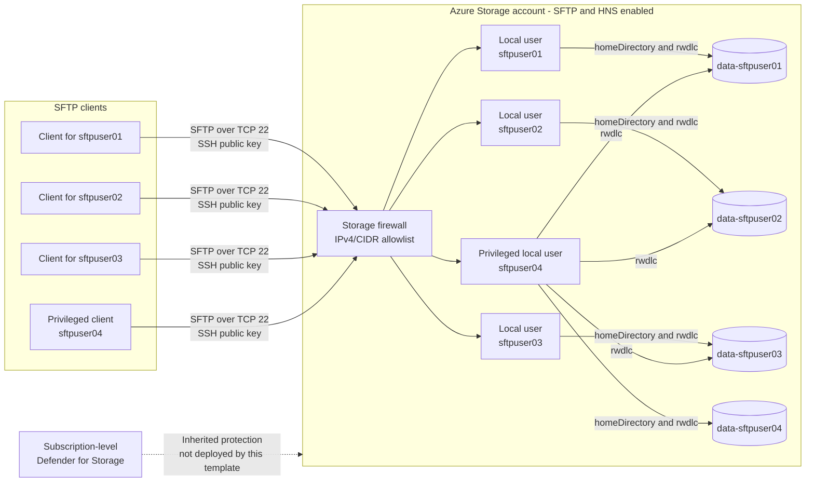

# Azure Storage SFTP Deployment Guide

This guide deploys the resources defined in `main.bicep` by using the values in `main.bicepparam`.

## Resources Deployed

- One Standard LRS `StorageV2` storage account
- Hierarchical namespace (HNS), SFTP, and local users enabled
- One private Blob container per local user, named `<prefix>-<username>` or `<username>` when the prefix is empty
- Exactly four SFTP local users authenticated with SSH public keys
- `sftpuser01` through `sftpuser03` are restricted to their own containers
- `sftpuser04` uses its own container as its home directory and can access all four user containers
- Public network access restricted to an explicit IPv4/CIDR allowlist
- Minimum TLS version of 1.2
- No `SecurityControl` tag by default; it can be enabled through a deployment parameter

Azure may also display a platform-managed Event Grid System Topic associated with the storage account. It is not explicitly declared or managed by this Bicep template.

## Architecture



## Template Structure

- `sftp/main.bicep` defines deployment parameters, orchestrates the modules, and returns consolidated outputs.
- `sftp/storage-account.bicep` deploys the StorageV2 account and its SFTP/HNS security settings.
- `sftp/blob-containers.bicep` deploys the Blob service and one private container per local user.
- `sftp/sftp-users.bicep` deploys local users and binds each user to its corresponding container and permissions.
- `sftp/main.bicepparam` supplies environment-specific deployment values.

Deployments continue to use `main.bicep` as the entry point. The resource modules are not deployed separately.

## Software Prerequisites

Install the following software on the deployment workstation:

1. [PowerShell 7](https://learn.microsoft.com/powershell/scripting/install/installing-powershell)
2. [Azure CLI](https://learn.microsoft.com/cli/azure/install-azure-cli), using the latest available version
3. Azure Bicep CLI, installed through Azure CLI
4. OpenSSH Client, including `ssh-keygen` and `sftp`

Verify the installed tools:

```powershell
$PSVersionTable.PSVersion
az version
az bicep install
az bicep version
ssh-keygen -?
sftp -?
```

To update an existing Bicep CLI installation:

```powershell
az bicep upgrade
```

## Azure Prerequisites

- An active Azure subscription
- At least the `Contributor` role on the target resource group or subscription
- A region that supports Azure Blob Storage SFTP
- A globally unique storage account name containing 3-24 lowercase letters and numbers
- Permission to register the `Microsoft.Storage` resource provider if it is not already registered
- Subscription-level Defender for Storage V2 with on-upload malware scanning, or access to a subscription administrator who can enable it

SFTP has an hourly charge while it is enabled, in addition to normal storage and transaction charges. Review current Azure Storage pricing before deployment.

## Prepare the Parameters

From the repository root, open the deployment directory:

```powershell
Set-Location .\sftp
```

The template requires exactly four local users. Generate a separate SSH key pair for each user if suitable keys do not already exist:

```powershell
New-Item -ItemType Directory -Path "$HOME\.ssh\azure-sftp" -Force | Out-Null
ssh-keygen -t rsa -b 4096 -f "$HOME\.ssh\azure-sftp\sftpuser01" -C "sftpuser01"
ssh-keygen -t rsa -b 4096 -f "$HOME\.ssh\azure-sftp\sftpuser02" -C "sftpuser02"
ssh-keygen -t rsa -b 4096 -f "$HOME\.ssh\azure-sftp\sftpuser03" -C "sftpuser03"
ssh-keygen -t rsa -b 4096 -f "$HOME\.ssh\azure-sftp\sftpuser04" -C "sftpuser04"
```

Display each public key:

```powershell
Get-Content "$HOME\.ssh\azure-sftp\sftpuser01.pub"
Get-Content "$HOME\.ssh\azure-sftp\sftpuser02.pub"
Get-Content "$HOME\.ssh\azure-sftp\sftpuser03.pub"
Get-Content "$HOME\.ssh\azure-sftp\sftpuser04.pub"
```

Edit `main.bicepparam` and set:

- `storageAccountName` to a globally unique name
- `blobContainerNamePrefix` to the optional container name prefix; the default creates `data-sftpuser01` through `data-sftpuser04`, while `''` creates `sftpuser01` through `sftpuser04`
- `enableSecurityControlTag` to `true` only when the storage account requires the `SecurityControl=Ignore` tag; the default is `false`
- `allowedIpRanges` to the fixed public IPv4 addresses or CIDR ranges used by the SFTP clients; an empty array denies all public SFTP clients
- Each `localUsers` entry to the required username and matching public key
- `sftpuser04.accessibleUserNames` to `sftpuser01` through `sftpuser04`, granting access to all four generated containers

Only public keys belong in `main.bicepparam`. Never place private key content in the parameter file or source control.

Replace the documentation-only address `203.0.113.10` before deployment. Use the client's internet-facing egress address after NAT or an enterprise firewall, not a private address such as `10.x.x.x` or `192.168.x.x`. The Storage firewall denies every source that is not listed. Up to 400 IP rules are supported.

Users `sftpuser01` through `sftpuser03` receive `rwdlc` permissions only on their own generated containers. `sftpuser04` receives `rwdlc` on all four containers and is therefore a privileged user that can list, read, create, modify, and delete every user's SFTP data. Its `homeDirectory` remains `data-sftpuser04`; the home directory controls the initial location, not the full authorization scope.

## Sign In and Select a Subscription

Set the deployment values for the current PowerShell session:

```powershell
$subscriptionId = '<subscription-id>'
$resourceGroupName = 'rg-sftp'
$location = 'eastus2'
$deploymentName = "sftp-$(Get-Date -Format 'yyyyMMdd-HHmmss')"
```

Authenticate and select the target subscription:

```powershell
az login
az account set --subscription $subscriptionId
az account show --query '{subscription:name, subscriptionId:id, tenantId:tenantId}' --output table
```

## Verify Defender for Storage

This deployment inherits Microsoft Defender for Storage settings from the subscription and does not enable or override them at the storage account level. Query the selected subscription:

```powershell
az security pricing show `
  --name StorageAccounts `
  --query '{pricingTier:pricingTier, subPlan:subPlan, extensions:extensions}' `
  --output jsonc
```

Defender for Storage V2 with on-upload malware scanning is enabled only when all of the following are present in the result:

- `pricingTier` is `Standard`
- `subPlan` is `DefenderForStorageV2`
- The `OnUploadMalwareScanning` extension has `isEnabled` set to `True`

Run this PowerShell check to evaluate all three conditions:

```powershell
$defenderStorage = az security pricing show `
  --name StorageAccounts `
  --output json | ConvertFrom-Json

$onUploadMalwareScanning = $defenderStorage.extensions |
  Where-Object { $_.name -eq 'OnUploadMalwareScanning' }

$defenderStorageV2Enabled =
  $defenderStorage.pricingTier -eq 'Standard' -and
  $defenderStorage.subPlan -eq 'DefenderForStorageV2' -and
  [string]$onUploadMalwareScanning.isEnabled -eq 'True'

if (-not $defenderStorageV2Enabled) {
  throw 'Defender for Storage V2 with on-upload malware scanning is not enabled for this subscription.'
}

Write-Host 'Defender for Storage V2 with on-upload malware scanning is enabled.'
```

If the check fails, ask a subscription `Owner` or `Security Admin` to enable Defender for Storage V2 and its `OnUploadMalwareScanning` extension. Do not add a storage-account-level override unless this account intentionally requires settings that differ from the subscription policy. Subscription-level protection for a newly created storage account can take time to propagate, so verify the account protection status and upload scanning after deployment.

Register the required resource providers:

```powershell
az provider register --namespace Microsoft.Storage --wait
az provider register --namespace Microsoft.EventGrid --wait
```

Create the resource group if it does not already exist:

```powershell
az group create `
  --name $resourceGroupName `
  --location $location `
  --output table
```

## Validate the Deployment

Compile the Bicep template locally:

```powershell
az bicep build --file .\main.bicep --stdout | Out-Null
```

Validate the template and parameter file against Azure Resource Manager:

```powershell
az deployment group validate `
  --name $deploymentName `
  --resource-group $resourceGroupName `
  --parameters .\main.bicepparam `
  --output table
```

Preview the proposed changes:

```powershell
az deployment group what-if `
  --name $deploymentName `
  --resource-group $resourceGroupName `
  --parameters .\main.bicepparam
```

Review the `what-if` output before continuing. The parameter file uses its `using './main.bicep'` declaration, so `--template-file` must not be supplied with these deployment commands.

## Deploy

Run the resource-group deployment:

```powershell
az deployment group create `
  --name $deploymentName `
  --resource-group $resourceGroupName `
  --parameters .\main.bicepparam `
  --output table
```

Display the deployment outputs:

```powershell
az deployment group show `
  --name $deploymentName `
  --resource-group $resourceGroupName `
  --query properties.outputs `
  --output jsonc
```

## Verify the Deployment

Read the deployed storage account name from the deployment:

```powershell
$storageAccountName = az deployment group show `
  --name $deploymentName `
  --resource-group $resourceGroupName `
  --query 'properties.parameters.storageAccountName.value' `
  --output tsv
```

Verify the storage account configuration and local users:

```powershell
az storage account show `
  --name $storageAccountName `
  --resource-group $resourceGroupName `
  --query '{name:name, location:location, hnsEnabled:isHnsEnabled, sftpEnabled:isSftpEnabled, localUsersEnabled:isLocalUserEnabled, publicNetworkAccess:publicNetworkAccess}' `
  --output table

az storage account show `
  --name $storageAccountName `
  --resource-group $resourceGroupName `
  --query 'networkRuleSet.{defaultAction:defaultAction, bypass:bypass, ipRules:ipRules}' `
  --output jsonc

az storage account local-user list `
  --account-name $storageAccountName `
  --resource-group $resourceGroupName `
  --query '[].{name:name, homeDirectory:homeDirectory}' `
  --output table
```

Verify the Blob containers:

```powershell
az storage container-rm list `
  --storage-account $storageAccountName `
  --resource-group $resourceGroupName `
  --query '[].name' `
  --output table
```

The expected names use `<blobContainerNamePrefix>-<localUserName>` and are converted to lowercase. When `blobContainerNamePrefix` is empty, each container name is the lowercase local username without a leading hyphen.

## Test an SFTP Connection

Create a small test file:

```powershell
Set-Content -Path .\sftp-test.txt -Value 'Azure Storage SFTP connectivity test'
```

Connect as the first local user. Azure Storage SFTP uses the login format `<storage-account>.<local-user>`:

```powershell
$localUserName = 'sftpuser01'
$sftpLogin = "${storageAccountName}.${localUserName}"
$sftpHostName = "${storageAccountName}.blob.core.windows.net"

sftp -i "$HOME\.ssh\azure-sftp\sftpuser01" "${sftpLogin}@${sftpHostName}"
```

At the interactive SFTP prompt, test the assigned permissions:

```text
pwd
ls
put sftp-test.txt
ls
get sftp-test.txt sftp-download-test.txt
rm sftp-test.txt
exit
```

The template grants `rwdlc` permissions: read, write, delete, list, and create. Password authentication and shared-key authentication are disabled for these local users.

### Test sftpuser04

Before testing from a public network, add the test workstation's internet-facing IPv4 address to `allowedIpRanges` and redeploy. With `allowedIpRanges = []` and the storage firewall `defaultAction` set to `Deny`, every public SFTP connection is blocked.

First connect without specifying a container. This verifies that the privileged user's home directory is its own `data-sftpuser04` container:

```powershell
$sftpHostName = "${storageAccountName}.blob.core.windows.net"
$user04Key = "$HOME\.ssh\azure-sftp\sftpuser04"

sftp -i $user04Key "${storageAccountName}.sftpuser04@${sftpHostName}"
```

At the SFTP prompt, upload and remove a test file in the home container:

```text
pwd
ls
put sftp-test.txt user04-home-test.txt
get user04-home-test.txt user04-home-download.txt
rm user04-home-test.txt
exit
```

To test another authorized container, reconnect and include the container name in the login username. Azure Storage SFTP treats a connected container as a virtual root, so switching containers is done by reconnecting with the target container rather than using `cd ..`. The following container names assume the default `data` prefix; omit `data-` when `blobContainerNamePrefix` is empty:

```powershell
$containers = @(
  'data-sftpuser01'
  'data-sftpuser02'
  'data-sftpuser03'
  'data-sftpuser04'
)

foreach ($container in $containers) {
  Write-Host "Connecting sftpuser04 to $container"
  sftp -i $user04Key "${storageAccountName}.${container}.sftpuser04@${sftpHostName}"
}
```

For each connection, run `pwd` and `ls`. To verify the full `rwdlc` scope, upload, download, and remove a uniquely named test file before exiting:

```text
pwd
ls
put sftp-test.txt user04-permission-test.txt
get user04-permission-test.txt user04-permission-download.txt
rm user04-permission-test.txt
exit
```

Successful operations in all four sessions confirm that `sftpuser04` can access every configured container. Failure in only one container usually indicates that its `permissionScopes.resourceName` does not match the generated container name.

### Upload SSH keys to sftpuser04

The `sftp/upload-keys-to-user04.ps1` script creates a `keys` directory under the `sftpuser04` home container and uploads key files from `$HOME\.ssh\azure-sftp`. By default, it uploads only `.pub` public keys:

```powershell
.\sftp\upload-keys-to-user04.ps1 `
  -StorageAccountName 'stsftpdatastorage01'
```

Preview the selected files and destination without connecting:

```powershell
.\sftp\upload-keys-to-user04.ps1 `
  -StorageAccountName 'stsftpdatastorage01' `
  -WhatIf
```

Uploading complete key pairs includes private keys and allows anyone who can read those files to authenticate as the corresponding SFTP users. Only use this option when storing private keys in the Blob container is an explicit security requirement:

```powershell
.\sftp\upload-keys-to-user04.ps1 `
  -StorageAccountName 'stsftpdatastorage01' `
  -IncludePrivateKeys
```

The private-key option requires typing `UPLOAD PRIVATE KEYS` before transfer. The script authenticates with `$HOME\.ssh\azure-sftp\sftpuser04` by default; override `-KeyDirectory` or `-IdentityFile` when keys are stored elsewhere. Before running it, allow the workstation's public IP in `allowedIpRanges`, deploy the firewall change, and establish one interactive SFTP connection if the storage endpoint's host key is not already trusted. Passphrase-protected identity files must be available through `ssh-agent` because the upload runs in SFTP batch mode.

## Troubleshooting

- **Storage account name unavailable:** choose another globally unique lowercase alphanumeric name in `main.bicepparam`.
- **Region does not support SFTP:** deploy to a supported Azure region by passing `location` in the parameter file or selecting a resource group in a supported region.
- **Authorization failure:** confirm the signed-in identity has deployment permissions and that the correct subscription is selected.
- **SSH authentication failure:** confirm the public key assigned to the local user matches the private key supplied with `sftp -i`.
- **Connection timeout or immediate disconnect:** confirm the client's current internet-facing IPv4 address is included in `allowedIpRanges` and that outbound TCP port 22 is permitted by the client network.
- **Home directory or permission failure:** confirm that the user's generated Blob container matches its `homeDirectory` and `permissionScopes.resourceName`.

Inspect deployment errors with:

```powershell
az deployment group show `
  --name $deploymentName `
  --resource-group $resourceGroupName `
  --query properties.error `
  --output jsonc
```

## Remove the Deployment

Deleting the resource group permanently deletes the storage account and all data in its Blob container:

```powershell
az group delete `
  --name $resourceGroupName `
  --yes
```

Confirm that no retained data or other required resources exist in the resource group before running this command.
